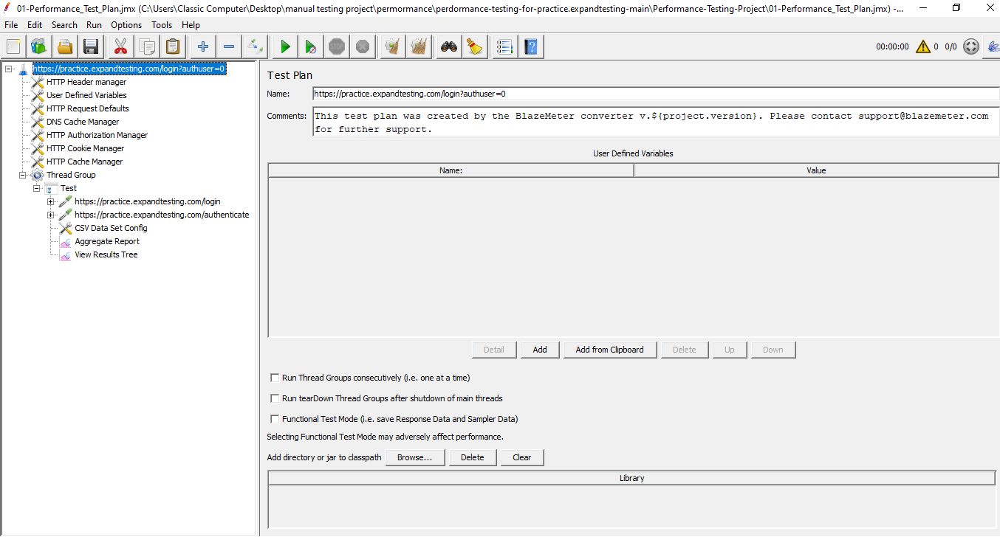
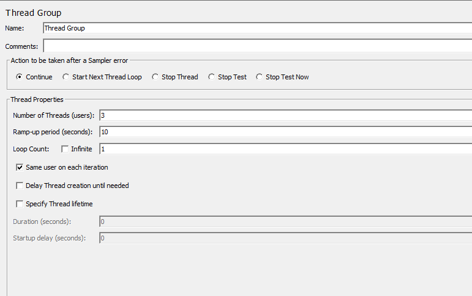
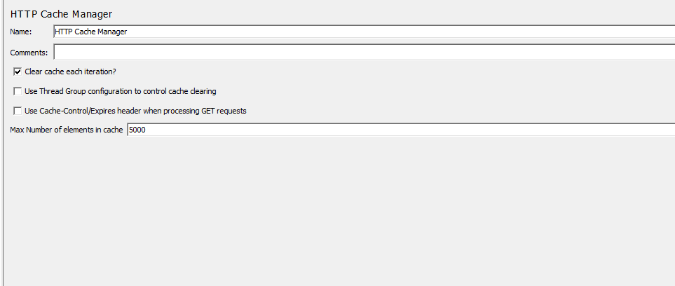
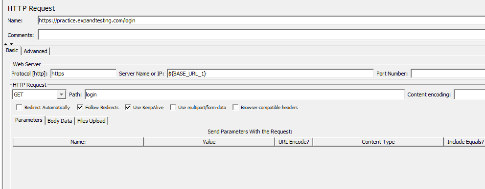
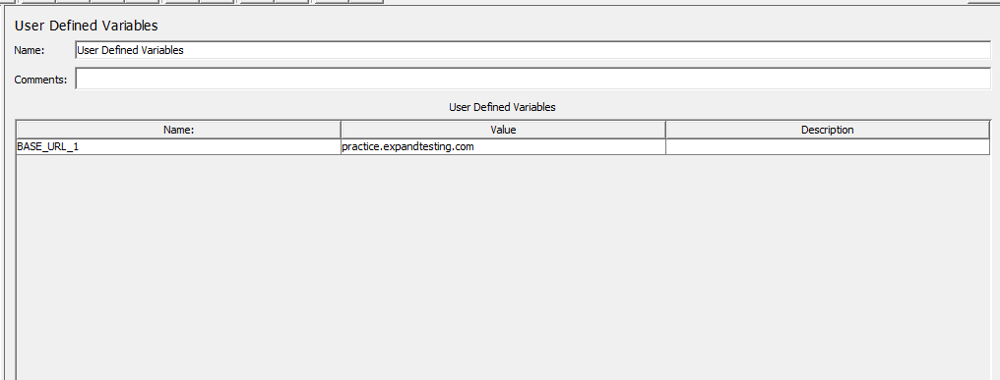
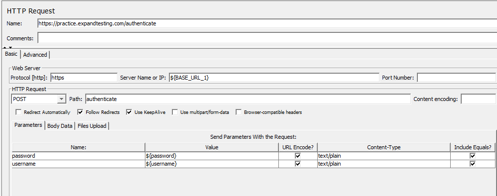
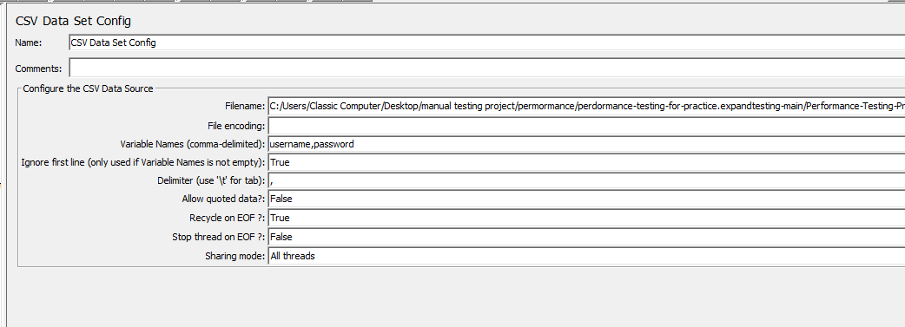
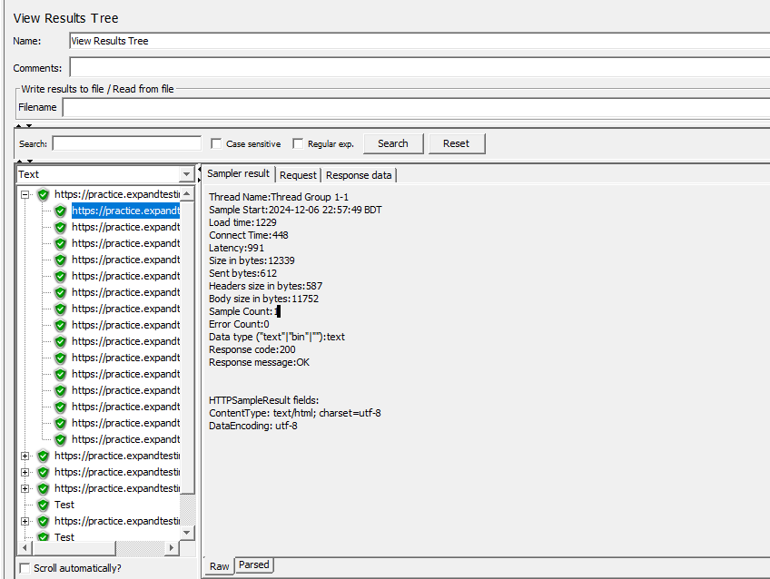
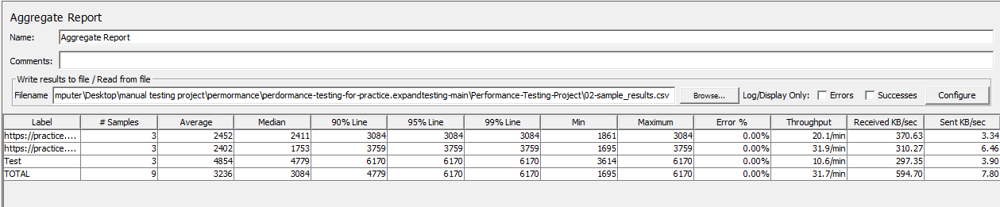

# **Performance Testing Project**

## **Overview**
This repository contains a performance testing project created with **Apache JMeter**. The test plan evaluates system performance under various load conditions, focusing on key metrics such as response time, throughput, and error rate.

---

## **Screenshots**

### 1. **JMeter Test Plan Setup**


### 2. **thread_group**


### 3. **HTTP_cache_manager**


### 4. **login_http_request**


### 5. **user_derified_variables**


### 6. **authenticate**


### 7. **csv_data_config**


### 8. **view_tree_result**


### 9. **Aggregate_report**


## **Features**
- Load testing with configurable user threads and ramp-up time.
- Custom HTTP requests to test API endpoints.
- Support for data-driven testing using `.csv` files.
- Automatic generation of HTML reports for result analysis.

---

## **Prerequisites**
1. Install [Apache JMeter](https://jmeter.apache.org/) (version 5.6 or later).
2. Ensure you have **Java 8 or higher** installed.

---


---

### **How to Use**
1. Save this Markdown content as `README.md`.
2. Place the `README.md` file in your repository root.
3. Ensure you include the referenced files (`Performance_Test_Plan.jmx`, `test_data.csv`, `sample_results.csv`, and `HTML_Report/`) in the appropriate directories.


## **How to Execute the Test**

### **1. Open the Test Plan**
1. Navigate to the cloned folder.
2. Open the `Performance_Test_Plan.jmx` file in Apache JMeter.

---

### **2. Configure Test Parameters**
Before running the test, ensure the following parameters are set:
- **Thread Group Settings**:
  - **Number of Threads (Users)**: Set the number of concurrent virtual users.
  - **Ramp-Up Period**: Time in seconds to start all threads gradually.
  - **Loop Count**: Number of iterations each user will execute.
- **Data File**:
  - If using parameterized testing, ensure `test_data.csv` contains valid test data.

---

### **3. Run the Test Plan**
1. Click the green **Start** button in JMeter to execute the test.
2. Monitor real-time results using listeners such as:
   - **Summary Report**
   - **View Results in Table**

---

### **4. Generate HTML Report**
After running the test, follow these steps to generate a detailed HTML performance report:

1. Export the test results to a `.csv` file (e.g., `sample_results.csv`).
2. Use the following command to generate the HTML report:
   ```bash
   jmeter -g sample_results.csv -o HTML_Report/


---


